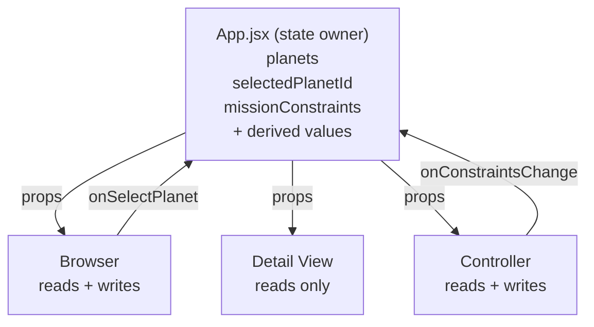

# Project Exodus

> Reactive exoplanet mission planner — three panels, one source of truth.

The interface is built around three communicating panels with shared state, props going down, and events going up. The chosen domain is exoplanet mission planning — the user picks a candidate from a catalog of 39 NASA-archive planets, sees its full dossier, and watches the GO / CAUTION / NO-GO verdict shift as they change the mission profile and constraints in the Controller.

## Design Intent

---

### 1. Domain & Why

I chose an exoplanet mission planning system because it naturally fits the three-panel structure required for this project.

There is a clear separation:
- a list of planets to explore (Browser),
- a focused view of one planet (Detail),
- and a set of controls that change the context (Controller).

What made this idea interesting to me is that it is not just filtering data. I wanted the system to feel like a decision-making tool, where changing the mission conditions actually changes how the same planet is evaluated. This makes the connection between panels much more visible and meaningful.

---

### 2. Data Model (JSON Shape)

All shared state lives in the App component. I kept the structure simple at first so I can clearly control how state flows between components.

```js
{
  planets: [ /* loaded from planets.json */ ],

  selectedPlanetId: "kepler-442-b",

  missionConstraints: {
    missionProfile: "crewed",
    maxDistanceLy: 100,
    tempRangeC: [-20, 50],
    allowedPlanetTypes: ["rocky", "super-earth"],
    minHabitabilityScore: 50,
    allowedDiscoveryMethods: ["Transit", "Radial Velocity", "Direct Imaging", "Microlensing"]
  }
}
```

Some values like filtered planets and feasibility scores are not stored as state. Instead, they are calculated from the existing data. I made this decision to avoid having multiple sources of truth and to keep the system predictable.

---

### 3. The Three Panels

**Browser (left)**
The Browser shows a list of planets. Each item includes basic information like name, distance, and a feasibility status based on current conditions. When a planet is clicked, it updates the selected planet in the App.

**Detail View (middle)**
The Detail View displays information about the currently selected planet. This includes key data and a feasibility breakdown showing whether the planet is a GO, CAUTION, or NO-GO. This panel does not manage its own state — it only reflects what it receives from the App.

**Controller (right)**
The Controller allows the user to change mission conditions such as distance, temperature range, and allowed planet types. When a control is changed, it updates the shared state, which causes the other panels to react.

---

### 4. Cross-Panel Reactivity

The most important part of this project is how the panels react to each other through shared state.

There are three main interactions:

- Clicking a planet in the Browser updates the Detail View.
- Changing a condition in the Controller updates the Browser list.
- Changing a condition in the Controller also updates the feasibility of the selected planet in the Detail View.

The key moment I am designing for is when the user changes one value in the Controller and sees both the Browser and Detail View update at the same time. This shows that all components are connected through a single state.

---

### 5. Feasibility Logic

The system evaluates each planet based on a set of conditions such as distance, temperature, planet type, and habitability score.

Instead of storing these results, they are calculated whenever the constraints change. This keeps the logic consistent and avoids unnecessary duplication of data.

The result is shown as:
- a score
- a status (GO, CAUTION, NO-GO)
- and a breakdown of checks

---

### 6. Visual Direction

The interface is designed to feel like a spacecraft bridge console — something you would actually see used to plan a mission, not a generic data dashboard.

The first pass was a flat dark UI with cyan accents. It was readable, but it did not match the domain. A mission planning tool for exoplanets should feel like deep space, not like a settings page. So the surface aesthetic was rebuilt around three ideas:

- **Real space, not "dark mode."** The body has two parallax-drifting starfields layered over a faint nebula gradient (purple at the top, cyan at the bottom). The panels float above this, never on a flat color.
- **Holographic glass.** Panels use translucent fills, `backdrop-filter: blur`, and corner brackets to read as projected HUD surfaces. A subtle scanline overlay reinforces this without competing for attention.
- **The system has a heartbeat.** The header sigil emits a slow pulsing ring, the live indicator twinkles, sliders glow when grabbed. Reactivity is the whole point of the project, so the visual layer signals "alive" without being noisy.

Color is restrained on purpose. Cyan is reserved for the "active" channel — selection, focus, mission state. Status colors stay legible with their own glow halos: green (GO), amber (CAUTION), magenta-red (NO-GO). Type pairs Orbitron (display, mission labels) with Space Grotesk (UI body) and JetBrains Mono (numbers and readouts).

The constraint I held was: **glow should always be functional.** Every shadow corresponds to either a state (selected, active, in-warning) or a focal point (the FEASIBILITY score). It should never decorate.

---

### 7. Intended Experience

I want the system to feel clear and responsive.

When the user interacts with one part of the interface, the rest of the system should respond immediately. The goal is for the user to understand that they are not just browsing data, but actively shaping the outcome through their decisions.

The most important experience is seeing how a small change in constraints can completely change the evaluation of a planet without changing the selection itself.

---

## System Diagram

How state flows between the App and its three panels.



The assignment-relevant shared state lives in App. Browser and Detail receive props and render from them. Controller is the only panel that writes mission constraint changes back up. The Intro screen and feasibility score animation use local UI state, but they do not own or duplicate planet data, selection, filters, or feasibility.

---

## AI Direction Log

These are the moments where I had to steer the project instead of just letting the code drift. I kept the entries concrete because this project is mostly about whether I can explain the system I directed.

### Entry 1 — I Kept the First Version Boring on Purpose
**Asked:** I asked for the first React structure after I had already written the three-panel idea and the JSON shape.
**AI produced:** A useful starting split: Browser, Detail View, Controller, and App.
**I changed:** I kept the important state in `App.jsx`: `planets`, `selectedPlanetId`, and `missionConstraints`. Browser only gets `onSelectPlanet(id)`, Controller only sends new constraints up, and Detail View does not get a setter.
**Why:** This is the part I need to be able to defend in crit. A boring parent-owned state model is clearer than a clever one.

### Entry 2 — I Did Not Store the Answer Twice
**Asked:** I asked for the GO / CAUTION / NO-GO feasibility logic and the sorted catalog.
**AI produced:** The right idea, but it was tempting to treat the filtered list and scores like their own state.
**I changed:** I made `calculateFeasibility` a pure function and kept `filteredPlanets`, `feasibilityByPlanetId`, `selectedPlanet`, and `feasibilityForSelected` as `useMemo` outputs.
**Why:** If the answer can be recalculated from planets + constraints, it should not be stored separately. That is the main React lesson here.

### Entry 3 — I Made the Controller Prove the Point
**Asked:** I asked for the mission profile toggle, sliders, and checkbox controls.
**AI produced:** Controls that looked plausible on their own.
**I changed:** I wired every control through `onConstraintsChange` or `onProfileChange` instead of letting the Controller keep its own version of the values.
**Why:** The Controller is where the assignment becomes visible. When the user changes a constraint, the catalog badges, sort order, mission context, and Detail verdict all need to react from the same state.

### Entry 4 — I Chose a Curated Dataset Instead of Live API Plumbing
**Asked:** I asked for the planet data to feel real, not like placeholder cards.
**AI produced:** A path toward NASA-style planet objects and a build script.
**I changed:** I used a static `public/planets.json` snapshot with 39 planets and kept `STARTER_PLANETS` only as a fallback.
**Why:** The assignment grades shared state, not live data fetching. A stable dataset means the demo will behave the same way in crit and on GitHub Pages.

### Entry 5 — I Cut Features That Would Distract from the Architecture
**Asked:** I asked what should be added before submission.
**AI produced:** A list of possible extras: persistence, more effects, and a few A+ polish ideas.
**I changed:** I kept the extras small: mission-context readout, visual status flip, procedural planet hero, and better documentation. I did not add routing, authentication, a database, or saved settings.
**Why:** I want the project to feel finished, but I do not want to stand in crit explaining a feature that has nothing to do with Browser -> Detail -> Controller.

### Entry 6 — I Pushed the Visual Direction Past Generic Dark UI
**Asked:** The app worked, but it looked like a normal navy dashboard. I asked for it to feel more like a spacecraft mission console.
**AI produced:** Mostly a safer dark-mode polish pass.
**I changed:** I pushed it toward a full bridge-console treatment: starfield, nebula glow, holographic panels, scanlines, HUD corner brackets, status glows, and the procedural rotating planet.
**Why:** The visuals should support the interaction. If changing one slider changes the whole mission readout, the interface should feel alive enough for that reaction to register.

---

## Records of Resistance

These are the three resistance moments I would talk through if asked, "show me one place where you rejected what AI gave you."

### Resistance 1 — I Did Not Let Browser Own Selection
**AI gave me:** The natural-looking idea that the Catalog card list could track its selected card.
**I rejected because:** That would make Browser feel self-contained, but Detail View also needs the same selected planet. If both panels know selection separately, they can disagree.
**What I did instead:** `selectedPlanetId` lives in `App.jsx`. Browser gets the selected id as a prop and reports clicks upward with `onSelectPlanet(id)`.

### Resistance 2 — I Did Not Turn Derived Values into State
**AI gave me:** A version of the idea where filtered planets and feasibility scores could be treated like stored results.
**I rejected because:** That would make the app harder to trust. The score is not a fact by itself; it is a result of the current planet data and the current mission constraints.
**What I did instead:** I kept the scoring pure in `src/logic/feasibility.js` and derive the lists/scores in `App.jsx`.

### Resistance 3 — I Put Structure Before Spectacle
**AI gave me:** Visual and feature ideas before every reactive path had been verified.
**I rejected because:** A pretty interface would not save the project if clicking the Browser or changing the Controller did not update the other panels.
**What I did instead:** I verified the state wiring first, then added the spacecraft visual layer after the Browser, Detail View, and Controller were already communicating.

---

## Five Questions Reflection

1. **Can I defend this?** Yes, because the main architecture is simple enough for me to trace without hiding behind the interface. `App.jsx` owns the assignment-relevant state: `planets`, `selectedPlanetId`, and `missionConstraints`. Browser clicks only report an id upward, Controller changes only report constraint updates upward, and Detail View reads the selected planet and feasibility result instead of storing its own copy. The local animation and intro states are separate UI behavior, not duplicate domain state, so they do not break the single-source-of-truth rule.

2. **Is this mine?** Yes, because the project direction is tied to my chosen concept, not just to whatever AI generated first. I chose exoplanet mission planning because the same planet can change meaning under different mission constraints, which makes cross-panel reactivity visible. The mission-control palette, GO / CAUTION / NO-GO language, curated planet set, profile presets, and feasibility model all support that idea. AI helped with implementation options, but I kept rejecting choices that would make it feel like a generic dark dashboard or a bigger app than the assignment needed.

3. **Did I verify?** Yes, and I verified more than whether the page looked finished. I ran `npm run lint`, `npm run build`, and `node src/logic/__verify.mjs` to check code quality, production build behavior, and the feasibility logic. I also tested the main browser interactions directly: selecting a planet updates Detail View, changing the Controller changes the catalog scores, and switching mission profiles can flip the same selected planet's verdict. After noticing that hover and click felt slightly heavy, I reduced expensive visual work in the planet rendering and card transitions so the interaction supported the architecture instead of distracting from it.

4. **Would I teach this?** Yes, because I can explain the data flow as a concrete chain instead of a vague React idea. When the user clicks a Catalog card, Browser calls `onSelectPlanet(id)`, App updates `selectedPlanetId`, and Detail View rerenders from the new selected planet prop. When the user changes a Controller profile or slider, Controller sends the new constraints to App, and App derives new feasibility results for both the Catalog and the selected planet. That is props down, events up, and derived values recalculated from one source of truth.

5. **Is my documentation honest?** Yes, because it names both what the final app does and what I intentionally did not build. The README explains that this is a curated static dataset rather than live NASA API plumbing, because stable data is better for this assignment and for crit. It also admits the scope decisions: no routing, no database, no saved settings, and no duplicated stored feasibility results. Some controls are broader than the current dataset, such as Direct Imaging and Microlensing filters, so I describe them as part of the mission filter model instead of pretending every discovery method is evenly represented in the data.

---

## Data Source

All planet data is sourced from the **NASA Exoplanet Archive** (`pscomppars` table) cross-checked against the **PHL Habitable Worlds Catalog**. Because the assignment grades reactive architecture, not network plumbing, the data is captured as a static `public/planets.json` snapshot rather than fetched live at runtime. This keeps the demo deterministic for crit.

The dataset is curated, not raw — 39 confirmed exoplanets chosen for diversity:

- **The TRAPPIST-1 system** — all seven Earth-sized rocky planets at 40 ly, three of them in the habitable zone. Lets me show how a single host star produces both GO and NO-GO results.
- **Local neighbors** — Proxima Cen b, Barnard b, Ross 128 b, Wolf 1061 c, Tau Ceti e/f, GJ 1061 d. Closeness is a strong feasibility signal but not the only one (Proxima Cen b is too cold for the crewed profile).
- **Known habitable-zone candidates** — Kepler-442 b, Kepler-62 e/f, Kepler-186 f, K2-18 b. Distance is what disqualifies them, not their physical conditions — perfect for demonstrating how the same planet can change verdict when the mission profile changes.
- **Hot Jupiters and ultra-hot extremes** — KELT-9 b, WASP-12 b, 55 Cancri e. Included so the system has clear NO-GO failures to sort against.

The build script at `scripts/buildPlanets.mjs` takes the raw values, converts units (parsec → ly, kelvin → °C), classifies planet type by radius, and computes the habitability score before writing the JSON. Re-running the script will regenerate `public/planets.json` from the same source list.

---

## Run / Develop

```bash
# install
npm install

# run dev server (http://localhost:5173)
npm run dev

# rebuild the curated planet dataset
node scripts/buildPlanets.mjs

# run the feasibility verification harness (Scenarios A, B, C)
node src/logic/__verify.mjs

# production build
npm run build

# preview the production build locally
npm run preview

# deploy to GitHub Pages
npm run deploy
```

---

## File Structure

```
ReactiveSandbox/
├── public/
│   └── planets.json          ← curated NASA dataset (39 planets)
├── scripts/
│   └── buildPlanets.mjs      ← regenerates planets.json from RAW source
├── src/
│   ├── App.jsx               ← shared state owner + derived values
│   ├── components/
│   │   ├── Header.jsx        ← bridge title bar (read-only)
│   │   ├── Intro.jsx         ← cinematic shell state only
│   │   ├── Browser.jsx       ← Catalog (reads + onSelectPlanet)
│   │   ├── DetailView.jsx    ← Mission Detail (read-only)
│   │   ├── PlanetHero.jsx    ← rotating procedural planet canvas
│   │   ├── FeasibilityPanel.jsx ← animated verdict display
│   │   └── Controller.jsx    ← Mission ops (reads + onConstraintsChange)
│   ├── data/
│   │   ├── starterPlanets.js ← fallback dataset if planets.json fails
│   │   └── missionPresets.js ← crewed / probe / observation profiles
│   ├── logic/
│   │   ├── feasibility.js    ← pure function, weighted 5-check evaluation
│   │   ├── planetTexture.js  ← deterministic procedural planet textures
│   │   └── __verify.mjs      ← assertions for Scenarios A, B, C
│   ├── App.css               ← HUD layout, panels, glow, scanlines
│   └── index.css             ← design tokens, starfield, nebula
└── vite.config.js            ← `base: "./"` for portable GitHub Pages
```

The architectural rule is one line: **state lives in `App.jsx`; everything else is props down, events up.**
