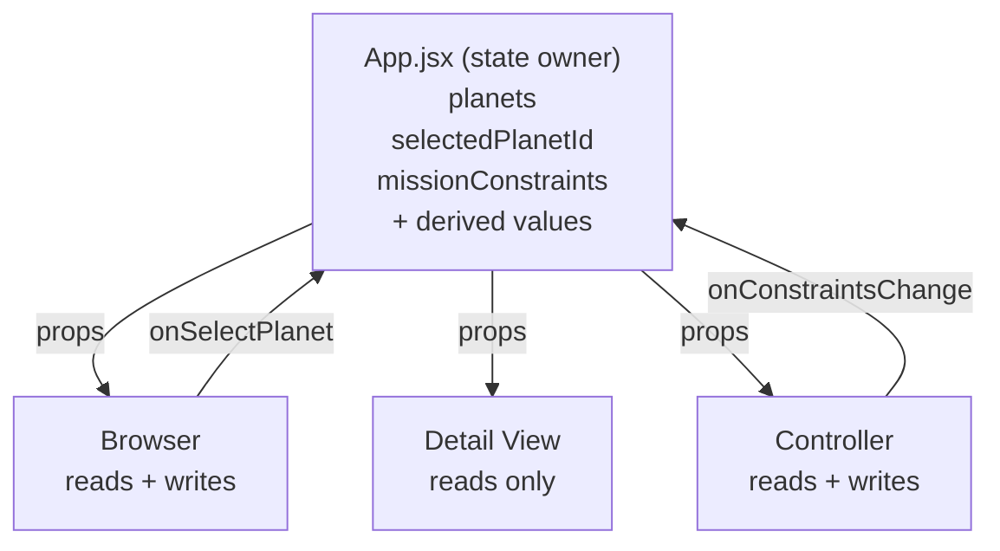

# Project Exodus

> Reactive exoplanet mission planner — three panels, one source of truth.

Live: https://chuseungh2.github.io/ReactiveSandbox/

Project Exodus is the submission for **AI 201 — Project 2: The Reactive Sandbox**. The interface is built around the prompt's core constraint: three communicating panels with shared state, props going down and events going up. The chosen domain is exoplanet mission planning — the user picks a candidate from a catalog of 39 NASA-archive planets, sees its full dossier, and watches the GO / CAUTION / NO-GO verdict shift as they change the mission profile and constraints in the Controller.

## Design Intent

> *This was written before starting implementation.*

---

### 1. Domain & Why

I chose an exoplanet mission planning system because it naturally fits the three-panel structure required for this project.

There is a clear separation:
- a list of planets to explore (Browser),
- a focused view of one planet (Detail),
- and a set of controls that change the context (Controller).

What made this idea interesting to me is that it is not just filtering data. I wanted the system to feel like a decision-making tool, where changing the mission conditions actually changes how the same planet is evaluated. This makes the connection between panels much more visible and meaningful.

---

### 2. Data Model (JSON Shape)

All shared state lives in the App component. I kept the structure simple at first so I can clearly control how state flows between components.

```js
{
  planets: [ /* loaded from planets.json */ ],

  selectedPlanetId: "kepler-442-b",

  missionConstraints: {
    missionProfile: "crewed",
    maxDistanceLy: 100,
    tempRangeC: [-20, 50],
    allowedPlanetTypes: ["rocky", "super-earth"],
    minHabitabilityScore: 50,
    allowedDiscoveryMethods: ["Transit", "Radial Velocity", "Direct Imaging", "Microlensing"]
  }
}
```

Some values like filtered planets and feasibility scores are not stored as state. Instead, they are calculated from the existing data. I made this decision to avoid having multiple sources of truth and to keep the system predictable.

---

### 3. The Three Panels

**Browser (left)**
The Browser shows a list of planets. Each item includes basic information like name, distance, and a feasibility status based on current conditions. When a planet is clicked, it updates the selected planet in the App.

**Detail View (middle)**
The Detail View displays information about the currently selected planet. This includes key data and a feasibility breakdown showing whether the planet is a GO, CAUTION, or NO-GO. This panel does not manage its own state — it only reflects what it receives from the App.

**Controller (right)**
The Controller allows the user to change mission conditions such as distance, temperature range, and allowed planet types. When a control is changed, it updates the shared state, which causes the other panels to react.

---

### 4. Cross-Panel Reactivity

The most important part of this project is how the panels react to each other through shared state.

There are three main interactions:

- Clicking a planet in the Browser updates the Detail View.
- Changing a condition in the Controller updates the Browser list.
- Changing a condition in the Controller also updates the feasibility of the selected planet in the Detail View.

The key moment I am designing for is when the user changes one value in the Controller and sees both the Browser and Detail View update at the same time. This shows that all components are connected through a single state.

---

### 5. Feasibility Logic

The system evaluates each planet based on a set of conditions such as distance, temperature, planet type, and habitability score.

Instead of storing these results, they are calculated whenever the constraints change. This keeps the logic consistent and avoids unnecessary duplication of data.

The result is shown as:
- a score
- a status (GO, CAUTION, NO-GO)
- and a breakdown of checks

---

### 6. Visual Direction

The interface is designed to feel like a spacecraft bridge console — something you would actually see used to plan a mission, not a generic data dashboard.

The first pass was a flat dark UI with cyan accents. It was readable, but it did not match the domain. A mission planning tool for exoplanets should feel like deep space, not like a settings page. So the surface aesthetic was rebuilt around three ideas:

- **Real space, not "dark mode."** The body has two parallax-drifting starfields layered over a faint nebula gradient (purple at the top, cyan at the bottom). The panels float above this, never on a flat color.
- **Holographic glass.** Panels use translucent fills, `backdrop-filter: blur`, and corner brackets to read as projected HUD surfaces. A subtle scanline overlay reinforces this without competing for attention.
- **The system has a heartbeat.** The header sigil emits a slow pulsing ring, the live indicator twinkles, sliders glow when grabbed. Reactivity is the whole point of the project, so the visual layer signals "alive" without being noisy.

Color is restrained on purpose. Cyan is reserved for the "active" channel — selection, focus, mission state. Status colors stay legible with their own glow halos: green (GO), amber (CAUTION), magenta-red (NO-GO). Type pairs Orbitron (display, mission labels) with Space Grotesk (UI body) and JetBrains Mono (numbers and readouts).

The constraint I held was: **glow should always be functional.** Every shadow corresponds to either a state (selected, active, in-warning) or a focal point (the FEASIBILITY score). It should never decorate.

---

### 7. Intended Experience

I want the system to feel clear and responsive.

When the user interacts with one part of the interface, the rest of the system should respond immediately. The goal is for the user to understand that they are not just browsing data, but actively shaping the outcome through their decisions.

The most important experience is seeing how a small change in constraints can completely change the evaluation of a planet without changing the selection itself.

---

## System Diagram

How state flows between the App and its three panels.



State lives only in App. Browser and Detail are read-only — they receive props and render. Controller is the only panel that writes back to App.

---

## AI Direction Log

These entries document the main places where I directed the build instead of just accepting whatever AI generated first.

### Entry 1 — Centralizing the State Model
**Asked:** Help turn the Project Exodus concept into a React app with a Browser, Detail View, and Controller.
**AI produced:** A workable component split, but the important decision still had to be made: where the shared state should live.
**I changed:** I made `App.jsx` the only owner of `planets`, `selectedPlanetId`, and `missionConstraints`. Browser receives `onSelectPlanet`, Controller receives `onConstraintsChange`, and Detail View receives only data.
**Why:** This directly matches the assignment's core rule: props go down, events go up, and shared state has one source of truth.

### Entry 2 — Keeping Derived Values Derived
**Asked:** Add feasibility scoring and filtered planet results.
**AI produced:** A structure where filtered planets and feasibility could easily have become extra state.
**I changed:** I kept `filteredPlanets`, `feasibilityByPlanetId`, `selectedPlanet`, and `feasibilityForSelected` as `useMemo` values instead of storing them with `useState`.
**Why:** Those values are always calculable from the real state. Storing them separately would create a second source of truth and make the crit harder to defend.

### Entry 3 — Making the Controller Drive the Whole System
**Asked:** Build controls for mission profile, distance, temperature, planet type, habitability, and discovery method.
**AI produced:** UI controls that could have stayed local to the Controller.
**I changed:** Every control now patches `missionConstraints` through the parent callback. The Browser count, Browser sorting, card badges, and selected planet feasibility all react to the same change.
**Why:** Scenario C is the strongest proof that this is not just a static filter page. One Controller change updates the other panels through shared state.

### Entry 4 — Data Scope and Scientific Grounding
**Asked:** Move beyond placeholder planets and use a real exoplanet-style dataset.
**AI produced:** A JSON-driven data model and a starter fallback path.
**I changed:** I kept `public/planets.json` as the curated dataset and left `STARTER_PLANETS` as a fallback so the app still works if the JSON request fails locally.
**Why:** The project needs enough real data to feel like a mission planning tool, but it should still be simple enough to explain in a five-minute crit.

### Entry 5 — Submission Stability Over Extra Features
**Asked:** Identify what to improve before submission.
**AI produced:** Several possible polish directions, including optional A+ features.
**I changed:** I prioritized README completion, lint stability, build verification, and the visible mission-context readout in Detail View. I did not add routing, authentication, storage, sound, or sparkline history.
**Why:** The rubric rewards a clear reactive system and honest documentation more than extra features. Extra scope would make the architecture harder to explain.

### Entry 6 — Pushing the Visual Layer to Match the Domain
**Asked:** The first build was working but felt visually flat — a generic navy dashboard. I asked for a real spacecraft cockpit aesthetic.
**AI produced:** A safe palette swap (slightly bluer dark) and slightly bigger headings.
**I changed:** I rejected the surface tweak and asked for a structural redesign instead — animated starfield + nebula behind everything, holographic glass panels with backdrop-blur, HUD corner brackets, scanlines, and per-state glow on cyan/GO/CAUTION/NO-GO. I also kept the constraint that **glow must always be functional**, never decorative — every shadow encodes state or focus.
**Why:** The architecture rule is "the panels react to each other through shared state." If the visuals look static, the reactivity does not register at first glance. The new aesthetic makes a constraint slider feel like it is firing through the whole bridge — which is what the project is actually about.

---

## Records of Resistance

These are three moments where I narrowed, corrected, or redirected the implementation.

### Resistance 1 — No Duplicated Selection State
**AI gave me:** The tempting pattern of letting the Browser manage which card is selected because the click happens there.
**I rejected because:** If Browser owned its own selected planet, Detail View could fall out of sync or need a second copy. That is exactly the architectural bug this assignment warns against.
**What I did instead:** I kept `selectedPlanetId` in `App.jsx` and passed the current id down to Browser. Browser only reports clicks upward through `onSelectPlanet(id)`.

### Resistance 2 — No Stored Feasibility Results
**AI gave me:** A direction where feasibility and filtered lists could be stored after calculation.
**I rejected because:** Feasibility depends on planet data and mission constraints. If it is stored separately, it can become stale when the Controller changes.
**What I did instead:** I put the calculation in the pure `calculateFeasibility` function and derive all feasibility outputs with `useMemo` in `App.jsx`.

### Resistance 3 — No Scope Creep Before the Baseline
**AI gave me:** Optional ideas like persistent settings, extra visual effects, and feature additions beyond the three-panel sandbox.
**I rejected because:** Those features would not help prove props-down/events-up, and they would make the project harder to finish and explain.
**What I did instead:** I focused on the required three panels, mission constraints, real-time feasibility, GitHub Pages readiness, and documentation.

---

## Five Questions Reflection

1. **Can I defend this?** Yes. The state owner is `App.jsx`, and the three panels communicate through props and callbacks. I can point to `selectedPlanetId` for Browser-to-Detail reactivity and `missionConstraints` for Controller-to-everything reactivity.

2. **Is this mine?** Yes. The mission-control direction, exoplanet domain, three mission profiles, weighted feasibility model, and Earth-size comparison all come from the Project Exodus concept. AI helped produce code, but I made the architectural choices that shape the system.

3. **Did I verify?** Yes. I checked that the feasibility logic is pure with `src/logic/__verify.mjs`, and I verified the production build with `npm run build`. I also checked that derived values are not duplicated as state in child components.

4. **Would I teach this?** Yes. I would explain it as one parent component holding the truth, with Browser and Controller sending events upward and Detail View reading the result. The clearest example is changing a Controller slider and watching both the catalog and selected planet assessment update.

5. **Is my documentation honest?** Yes. The README names the actual decisions in the code rather than pretending every idea was built. The curated dataset currently contains Transit and Radial Velocity planets; Direct Imaging and Microlensing remain available as mission filter options for the broader data model.

---

## Three Scenarios for Studio Crit

These are the demonstrations I will walk through during crit. Each one isolates a different reactive path through the system.

### Scenario A — Browser drives Detail
**Action:** Click *Proxima Centauri b* in the Catalog.
**What changes:** Detail View replaces its hero, metrics grid, Earth-size comparison, mission-context readout, and feasibility breakdown. The cyan select indicator moves in the Catalog.
**What stays:** The Controller. The mission constraints did not change, only `selectedPlanetId`.
**What this proves:** Browser → App → Detail. Detail is a pure prop receiver — it has no state of its own.

### Scenario B — Controller drives Browser
**Action:** With *crewed* profile selected, drag the Max Distance slider from 100 ly down to 25 ly. Then change the profile to *probe*.
**What changes:** The Catalog list re-sorts and shrinks (planets that exceed 25 ly are filtered out by `passesHardFilters`). The "X of 39 candidates" readout in the Controller updates live. When the profile flips, all six controls below snap to the preset and the Catalog reshuffles again.
**What stays:** Whichever planet the user had selected, if it is still in range. Otherwise the system gracefully picks the first candidate.
**What this proves:** Controller → App → Browser. The Browser is downstream of `missionConstraints` even though it never reads or writes that field directly.

### Scenario C — Controller flips the Detail verdict on the same planet
**Action:** Select *Kepler-442 b*. Note its status under the *crewed* profile (NO-GO at 1194 ly). Now switch to *observation* without re-clicking the planet.
**What changes:** The same planet, same selection, instantly reads as GO with score 100 and all five checks pass. The status color, glow, and check rows in the Feasibility panel all transition.
**What stays:** `selectedPlanetId` is unchanged.
**What this proves:** This is the strongest reactivity argument in the system. No planet was re-clicked. The verdict on the same data flipped because the constraints — and therefore the derived feasibility — changed. This is exactly what `useMemo` over `(planet, constraints)` is supposed to give us.

The verification harness at `src/logic/__verify.mjs` reproduces all three scenarios as assertions and ran 11/11 pass at submission.

---

## Data Source

All planet data is sourced from the **NASA Exoplanet Archive** (`pscomppars` table) cross-checked against the **PHL Habitable Worlds Catalog**. Because the assignment grades reactive architecture, not network plumbing, the data is captured as a static `public/planets.json` snapshot rather than fetched live at runtime. This keeps the demo deterministic for crit.

The dataset is curated, not raw — 39 confirmed exoplanets chosen for diversity:

- **The TRAPPIST-1 system** — all seven Earth-sized rocky planets at 40 ly, three of them in the habitable zone. Lets me show how a single host star produces both GO and NO-GO results.
- **Local neighbors** — Proxima Cen b, Barnard b, Ross 128 b, Wolf 1061 c, Tau Ceti e/f, GJ 1061 d. Closeness is a strong feasibility signal but not the only one (Proxima Cen b is too cold for the crewed profile).
- **Known habitable-zone candidates** — Kepler-442 b, Kepler-62 e/f, Kepler-186 f, K2-18 b. Distance is what disqualifies them, not their physical conditions — perfect for Scenario C.
- **Hot Jupiters and ultra-hot extremes** — KELT-9 b, WASP-12 b, 55 Cancri e. Included so the system has clear NO-GO failures to sort against.

The build script at `scripts/buildPlanets.mjs` takes the raw values, converts units (parsec → ly, kelvin → °C), classifies planet type by radius, and computes the habitability score before writing the JSON. Re-running the script will regenerate `public/planets.json` from the same source list.

---

## Run / Develop

```bash
# install
npm install

# run dev server (http://localhost:5173)
npm run dev

# rebuild the curated planet dataset
node scripts/buildPlanets.mjs

# run the feasibility verification harness (Scenarios A, B, C)
node src/logic/__verify.mjs

# production build
npm run build

# preview the production build locally
npm run preview

# deploy to GitHub Pages
npm run deploy
```

---

## File Structure

```
ReactiveSandbox/
├── public/
│   └── planets.json          ← curated NASA dataset (39 planets)
├── scripts/
│   └── buildPlanets.mjs      ← regenerates planets.json from RAW source
├── src/
│   ├── App.jsx               ← THE STATE OWNER — useState ×3, useMemo ×4
│   ├── components/
│   │   ├── Header.jsx        ← bridge title bar (read-only)
│   │   ├── Browser.jsx       ← Catalog (reads + onSelectPlanet)
│   │   ├── DetailView.jsx    ← Mission Detail (read-only)
│   │   └── Controller.jsx    ← Mission ops (reads + onConstraintsChange)
│   ├── data/
│   │   ├── starterPlanets.js ← fallback dataset if planets.json fails
│   │   └── missionPresets.js ← crewed / probe / observation profiles
│   ├── logic/
│   │   ├── feasibility.js    ← pure function, weighted 5-check evaluation
│   │   └── __verify.mjs      ← assertions for Scenarios A, B, C
│   ├── App.css               ← HUD layout, panels, glow, scanlines
│   └── index.css             ← design tokens, starfield, nebula
└── vite.config.js            ← `base: "./"` for portable GitHub Pages
```

The architectural rule is one line: **state lives in `App.jsx`; everything else is props down, events up.**
